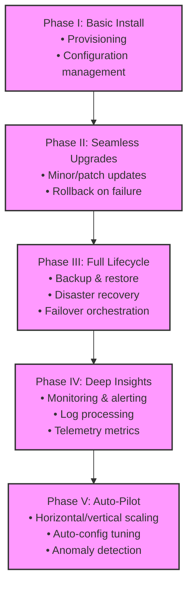

# Operator Maturity Model & Golden Signals

An Operator's sophistication increases through defined evolutionary phases. This guide outlines the Red Hat Operator Maturity Model and provides instructions for telemetry instrumentation using the SRE "Four Golden Signals".

---

## 1. The Operator Maturity Model

Operators progress from basic packaging to fully autonomous lifecycle managers.

---

## 2. Implementing the Five Phases

### Phase I: Basic Install
- **Goal**: Automate application deployment.
- **Design Pattern**: Implement standard deployment, service, configmap, and secrets validation. The Operator acts as a template compiler.

### Phase II: Seamless Upgrades
- **Goal**: Automate software upgrades without data loss.
- **Design Pattern**: Implement rolling update algorithms and version checkers. Verify the cluster quorum remains stable during pod rotation.

### Phase III: Full Lifecycle
- **Goal**: Implement automatic backup and restore loops.
- **Design Pattern**: Declare CRDs for backups (e.g., `kind: DatabaseBackup`) and restores. The Operator spins up transient K8s `Jobs` to run database dump binaries (like `mysqldump` or `pg_dump`), upload targets to S3 storage, and clean up.

### Phase IV: Deep Insights
- **Goal**: Instrument the Operator to report on its own and the operand's performance.
- **Design Pattern**: Expose a Prometheus metrics endpoint (`/metrics`) listing application-specific status.

### Phase V: Auto-Pilot
- **Goal**: Autonomously correct anomalies.
- **Design Pattern**: Implement auto-scaling controllers. If disk usage hits a saturation high-water mark, the Operator can trigger storage expansion on PersistentVolumeClaims (PVCs) automatically.

---

## 3. Telemetry and the Four Golden Signals
To achieve Phase IV and V maturity, the Operator must inspect and report on the **Four Golden Signals** of SRE:

### A. Latency
- **Definition**: The time taken to service a request or execute an operation.
- **Operator Metrics**:
  - Reconcile loop duration (time elapsed during one execution of `Reconcile()`).
  - Time elapsed to spin up a new replica and verify its membership.
- **Go Instrumentation**: Record duration metrics in a Prometheus histogram.

### B. Traffic
- **Definition**: A measure of demand on the system.
- **Operator Metrics**:
  - Total number of reconciliation loops triggered (rate per minute).
  - Transactions per second processed by the managed database operand.
- **Go Instrumentation**: Expose a counter for reconcile count.

### C. Errors
- **Definition**: The rate of requests that fail.
- **Operator Metrics**:
  - Reconcile failures (reconciliation loops returning error instead of success).
  - Failures in child resource creation or validation.
  - Operand-level failures (e.g. database query crash rates).
- **Action**: Alert human operators when the error-rate cross-reconcile threshold exceeds a SLA boundary.

### D. Saturation
- **Definition**: A measure of system fullness, highlighting the most constrained resources.
- **Operator Metrics**:
  - Memory consumption of the Operator container (verify against container memory limits).
  - Storage space remaining on managed Persistent Volumes (PVCs).
- **Proactive Management**: The Operator should watch volume capacity. If storage saturation exceeds **90%** (performance degrades significantly before reaching 100%), the Operator must log warnings, send events, and proactively resize the PVC if volume expansion is enabled.
